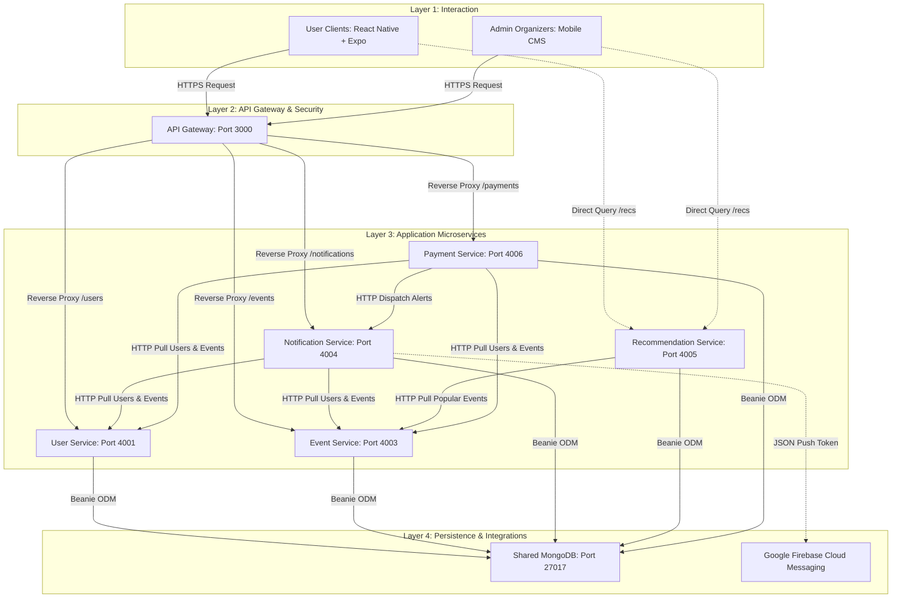

# 🏛️ Architecture Overview

This explanation guide describes the logical and physical architecture of the **back_cumbe** event management system, contrasting the conceptual academic requirements in `docs/pf.pdf` with the actual microservice codebase implementation.

---

## 🌟 Conceptual Framework
The platform solves a critical smart city challenge in Barranquilla: the communication and tracking of small and medium-scale cultural events (such as *verbenas*, *picós*, folklore dances, artisan fairs). These events are highly decentralized and typically advertised only on private WhatsApp groups or Instagram stories.

By providing a structured, scalable backend, the platform enables:
1. **Hyper-local Cultural Discovery**: Personalized categories reflecting the coastal identity (*champeta*, *vallenato*, *cumbia*).
2. **Community Analytics**: Tracking real-time event attendance and user preferences.
3. **Independent Promotion**: Giving local cultural collectives a direct, accessible channel to publish events.

---

## 🗺️ Logical Architecture

The platform follows a classic decoupled layered architecture style:

---

## 💻 Physical Architecture: Conceptual vs. Implemented

The physical diagram (attached image) details an enterprise cloud environment, while the codebase is packaged as a local Docker Compose prototype. There are critical architectural gaps you must understand:

### 1. Authentication Layer
*   **Conceptual Design (Diagram):** Integrates **AWS Cognito** as a secure Multi-Factor Authentication (MFA) provider.
*   **Actual Codebase Implementation:** Implements a custom cryptographic token signer inside the `user-service` using **Bcrypt** for local salt hashing and **PyJWT** for generating stateless session tokens. Session tokens include `sub`, `role`, and `iat`, with `role` limited to `user` or `publisher`. In this model, security is managed at the code level, and microservices verify identity using a shared environmental key (`JWT_SECRET`) before allowing publisher-only operations.

### 2. Notifications Delivery
*   **Conceptual Design (Diagram):** Outlines **AWS SNS** (Simple Notification Service) as the alert gateway.
*   **Actual Codebase Implementation:** Utilizes the **Google Firebase Admin SDK** (Firebase Cloud Messaging - FCM) running on a Python scheduler worker. Mobile client application tokens (`fcm_token`) are managed directly in MongoDB and processed in batch schedules inside the `notification-service`.

### 3. Database Strategy
*   **Conceptual Design (Microservice best practice):** In ideal decoupled microservices, each service owns its database to ensure database autonomy.
*   **Actual Codebase Implementation:** Uses a **Shared MongoDB Instance** pattern. All five active services (`user-service`, `event-service`, `notification-service`, `payment-service`, and `recommendation-service`) connect to the exact same MongoDB container (`mongo:7`) and share access to the database `users_db`. They share Beanie Document classes, allowing database-level integration but coupling schema modifications.

---

## 📊 Summary of Port Mappings and Networking

In the local development docker environment:
*   The **Inbound Network** connects only port `3000` (API Gateway) to the outside world, preventing clients from accessing underlying services directly.
*   The **Internal Network** (managed by Docker virtual bridges) allows containers to communicate using internal DNS resolution (e.g. `http://user-service:4001` or `http://event-service:4003`).
